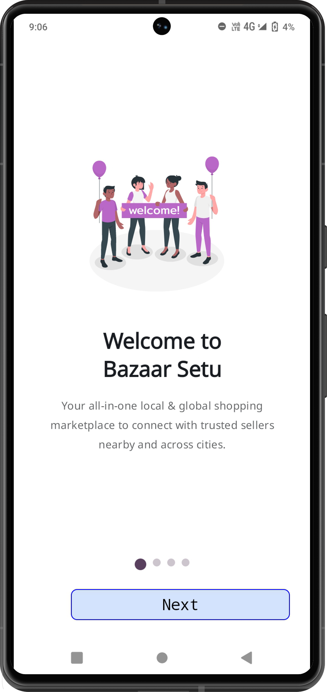
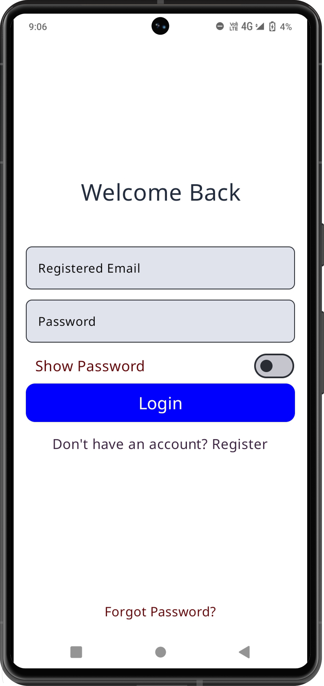
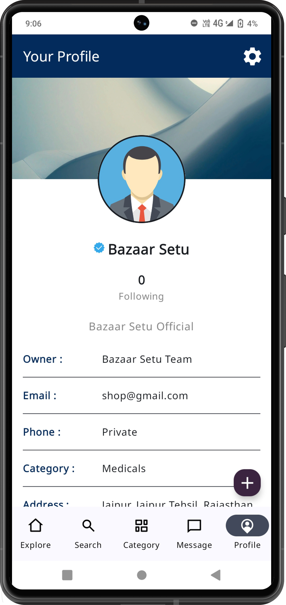
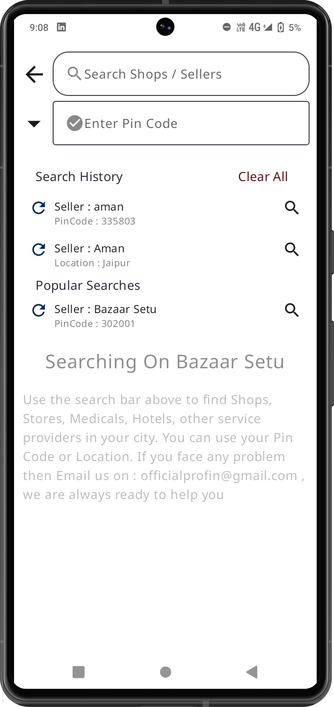
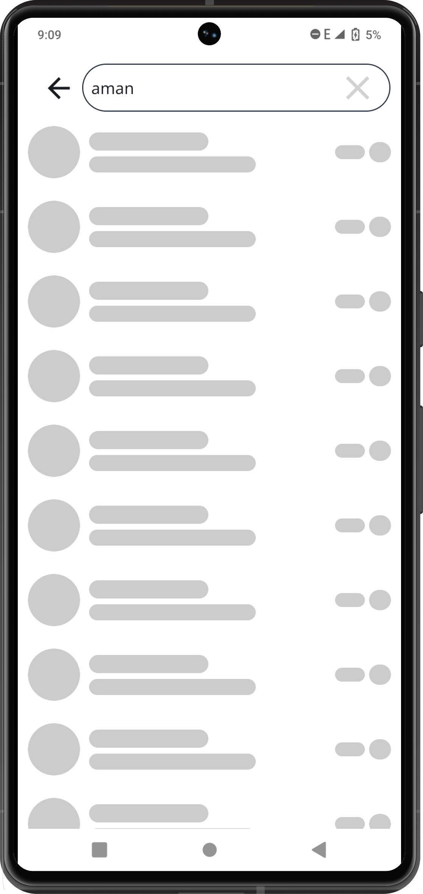
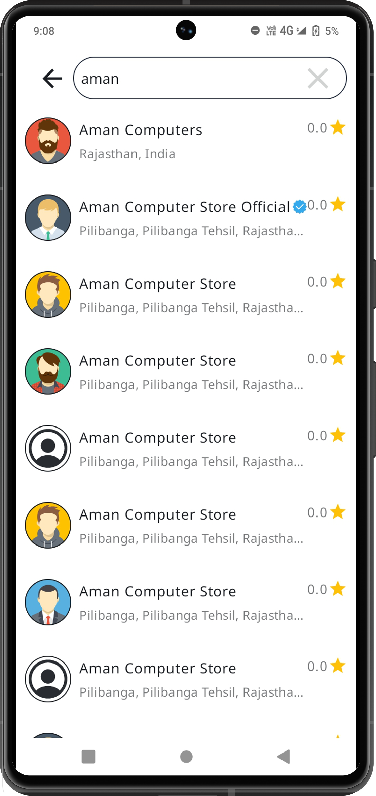
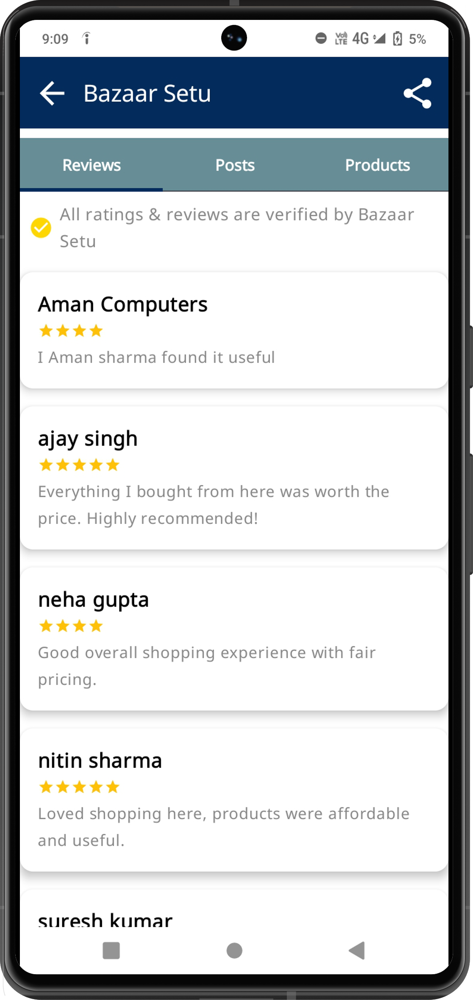
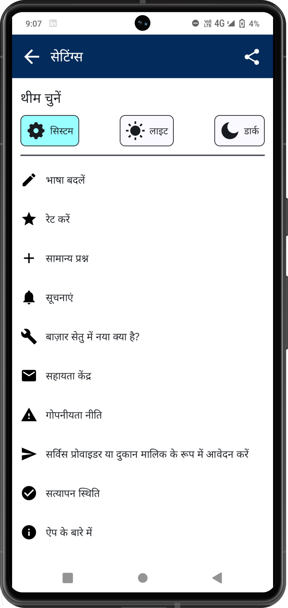

# 🛒 Bazaar Setu – Your Local & Global Shopping Marketplace

  

---

### 📱 About the App

**Bazaar Setu** is a full-featured marketplace app that connects users with verified local shops and national sellers. Customers can browse products, chat directly with shopkeepers, and enjoy fast delivery—all from one simple, powerful Android app.

> ✅ Available on Play Store: [Bazaar Setu](https://play.google.com/store/apps/details?id=com.market.search)

---

### 👨‍💻 My Role

I built the **entire app from scratch** — both frontend and backend — using modern Android and Kotlin technologies:

- 🔧 Full-stack Developer (Frontend + Backend)
- 🎨 UI development with **Jetpack Compose**
- ⚙️ Backend APIs using **Ktor Framework**
- 🔐 Implemented **secure token-based authentication**
- 🔄 Used **pagination, search, sorting, filtering etc**
- 🧠 Applied **MVVM architecture** and **Kotlin best practices**
- 🗄️ Used **DataStore** and **Room** for local storage
- ☁️ Integrated **Cloudinary** for media uploads and loaded via **Coil**
- 🎞️ Added rich user experience with **Lottie**, **Snackbars**, and **Shimmer loading**

---

### 🧰 Tech Stack

| Layer        | Tools & Frameworks                                 |
|--------------|----------------------------------------------------|
| Frontend     | Kotlin, Jetpack Compose, MVVM, Navigation, Coil    |
| Backend      | Kotlin, Ktor Framework                             |
| API Handling | Retrofit, OkHttp, Token Auth                       |
| Storage      | Room, DataStore                                    |
| UI Effects   | Lottie, Shimmer, Snackbar                          |
| Media        | Cloudinary for uploads, Coil for loading           |

---

### ✨ Key Features

- 🔍 Search products by keyword, category, and location
- 💬 Chat directly with verified sellers before buying
- 📍 Shop locally or across cities
- 🔒 Secure login and API access with token auth
- 🧾 Smart checkout and multiple payment options
- 🛒 Manage profiles, track orders, and favorite shops
- 🌐 Explore trending products across regions
- 🎨 Clean UI with modern animations and effects

---

### 🚧 Project Status

🛑 **Private Project – Source Code Not Public**

This repository is a showcase of my work on **Bazaar Setu** , a live, production-level Android app available on the Play Store (rated 4.9★). Due to confidentiality, only selected non-sensitive code snippets and UI components are shared.

---

### 📄 License

This repository is for showcase purposes only. All content is © Aman Sharma.  
No part may be copied, reused, or modified without written permission.

---

<h2>📸 Screenshots :</h2>

  
  
  
  
  
  
  
  
  
  

---

### 🙌 Contact

📧 [Email](mailto:officialprofin@gmail.com)  
🔗 [LinkedIn Profile](https://in.linkedin.com/in/engineer-aman-sharma)
